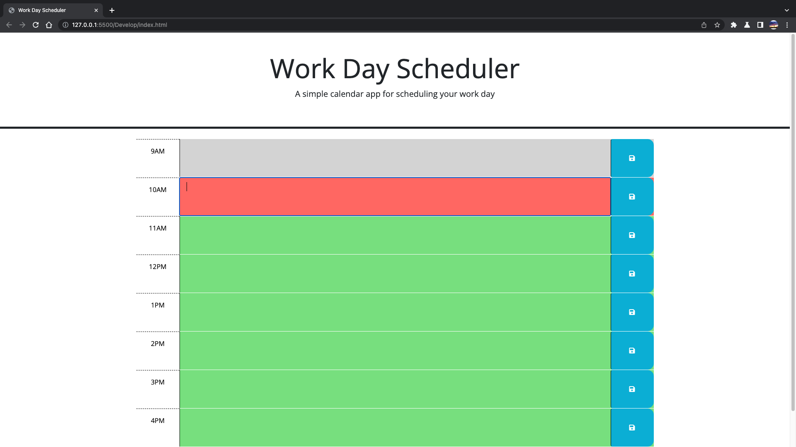
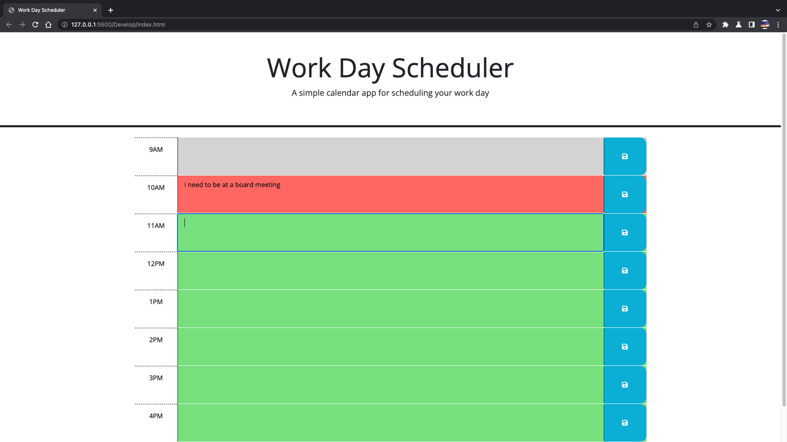
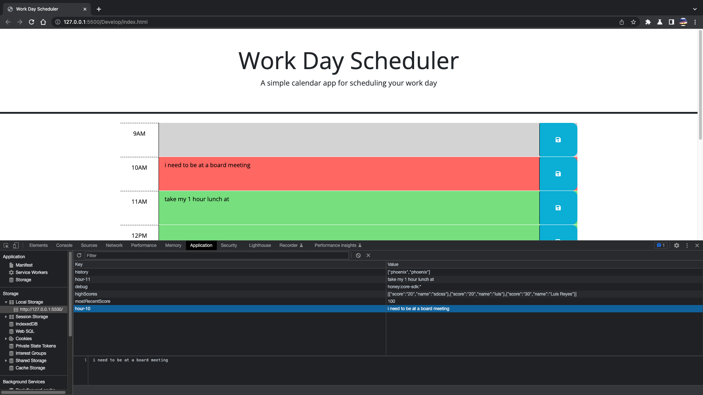

# Carlos Schedule Log

## Description
Use this calandar app to help you organize your busy work day schedule.

## User Story
As an employee or student with a busy schedule
I Want to be able insert events to a daily planner
So that I can manage my time

## Acceptance Criteria
Given I am using a daily planner to organize my schedule
When I open the planner
Then the current day is displayed at the top of the calendar
When I scroll down
Then I am shwon with time blocks from 9-5pm 
When I view the time blocks for that day
Then each time block is color coded to tell whether it is in the past, present, or future
When I click the time block
Then I can enter any information for that time of day
When I click the save button
Then it gets saved into local storage

